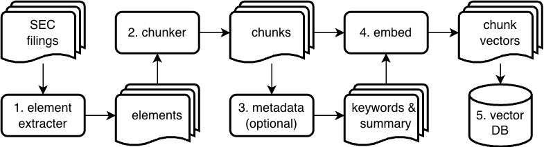
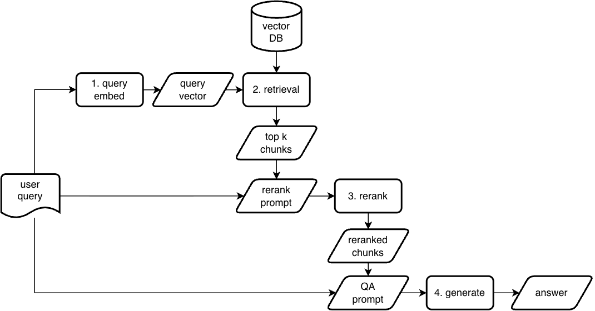

# 📈 Financial Document Analyzer

A Streamlit-based RAG application for analyzing financial PDFs. This project provides a full-stack solution for ingesting documents and asking questions using a local, private RAG pipeline.

## 📋 Table of Contents

1.  [Core Concepts](#-1-core-concepts)
    - [Project Vision & Goal](#-11-project-vision--goal)
    - [Key Features](#-12-key-features)
    - [The RAG Pipeline](#-13-the-rag-pipeline)
2.  [Getting Started](#-2-getting-started)
    - [Tech Stack](#-21-tech-stack)
    - [Prerequisites](#-22-prerequisites)
    - [Installation & Setup](#-23-installation--setup)
3.  [User Guide](#-3-user-guide)
    - [Ingesting Documents](#-31-ingesting-documents)
    - [Querying Documents via UI](#-32-querying-documents-via-ui)
    - [Evaluating Performance](#-33-evaluating-performance)
4.  [Architecture Deep Dive](#-4-architecture-deep-dive)
    - [Directory Structure](#-41-directory-structure)
    - [The QA Graph (`src/graph`)](#-42-the-qa-graph-srcgraph)
    - [Configuration Deep Dive (`configs/default.yaml`)](#-43-configuration-deep-dive-configsdefaultyaml)
5.  [Development & How-To Guide](#-5-development--how-to-guide)
    - [How to Change the Embedding Model?](#-51-how-to-change-the-embedding-model)
    - [How to Add a New Retrieval Mode?](#-52-how-to-add-a-new-retrieval-mode)
    - [How to Add a New Document Type?](#-53-how-to-add-a-new-document-type)

---

## 💡 1. Core Concepts

### 🎯 1.1. Project Vision & Goal

The **Financial Document Analyzer** is a Retrieval-Augmented Generation (RAG) application designed to efficiently analyze vast financial documents. Its primary goal is to empower financial analysts, researchers, and investors by dramatically reducing the time and effort required to review reports, thereby accelerating data-driven decision-making.

**Key Objectives:**

- **Enhanced Information Access:** Easily search and access information within complex financial PDFs using natural language queries.
- **Increased Analysis Efficiency:** Automate the manual review process to shorten the time needed for critical information extraction and summarization.
- **Trustworthy Answers:** Ensure the reliability and transparency of information by providing source attribution for every answer.

### ✨ 1.2. Key Features

- **🤖 Natural Language Querying:** Ask questions in plain English and receive precise answers from your documents.
- **⚙️ Automated Document Pipeline:** A fully automated pipeline for text extraction, chunking, metadata enrichment, embedding, and vector storage.
- **🔍 Flexible Retrieval Strategies:** Supports various retrieval methods, including vector, keyword, hybrid, and fusion search.
- **🧠 LLM-Powered Generation & Reranking:** Utilizes Large Language Models (LLMs) to generate relevant answers and optimize the ranking of retrieved documents.
- **🖥️ Streamlit User Interface:** An intuitive web UI for document uploads, queries, answer verification, and filtering.
- **📊 Benchmarking Tools:** Includes evaluation capabilities using datasets like FinanceBench to objectively measure system performance.

### 🔗 1.3. The RAG Pipeline

This project is built on a RAG (Retrieval-Augmented Generation) architecture.

#### 1.3.1. Ingestion Pipeline

The Ingestion Pipeline is the process of building the knowledge base from your documents.



#### 1.3.2. Querying Pipeline

The Querying Pipeline is how the system generates a precise answer to a user's question.



---

## 🚀 2. Getting Started

This section provides instructions for setting up the project, including the tech stack, prerequisites, and installation steps.

### 🛠️ 2.1. Tech Stack

- **🐍 Python 3.10+:** The core programming language.
- **🔗 LangGraph:** A framework for building robust, stateful LLM applications.
- **🖥️ Streamlit:** A framework for creating user-friendly web-based UIs.
- **🧠 Ollama:** A platform for running large language models locally.
- **💾 Weaviate:** A vector database for efficient storage and retrieval of vector embeddings.
- **📄 Unstructured.io:** A library for extracting text and structured data from PDF documents.
- **📦 `uv` / `pip`:** For Python dependency management.

### ✅ 2.2. Prerequisites

1.  **Python Environment:** A Python environment matching `pyproject.toml`.
2.  **Ollama Server:** A running Ollama server for local LLMs.
    - Example: `CUDA_VISIBLE_DEVICES=1 OLLAMA_HOST=http://127.0.0.1:11435 ollama serve`
    - Models used: `qwen2:7b`, `nomic-embed-text`, etc.
3.  **Network Ports:** Ports `8090` and `50061` must be free for the embedded Weaviate instance.
4.  **Data Folders:** `data/pdfs`, `data/processed`, and `data/logs` directories must exist. Note that `data/logs` is ignored by Git.

### ⚙️ 2.3. Installation & Setup

Follow this step-by-step guide to set up and run the project.

1.  **Install Dependencies:**

    ```bash
    uv sync
    # Or: pip install -e .
    ```

2.  **Run Ollama Server:**

    - Ensure the Ollama server is running as described in the prerequisites.

3.  **Run the Ingestion Pipeline:**

    - This sequence of scripts processes your PDFs and populates the vector database.
    - **Step 1: Extract Elements:**
      ```bash
      python cli/ingest1_elements.py --pdfs data/pdfs
      ```
    - **Step 2: Chunk Elements:**
      ```bash
      python cli/ingest2_chunking.py --elements data/processed/elements
      ```
    - **Step 3: Create Metadata (Recommended):**
      ```bash
      OLLAMA_HOST=http://127.0.0.1:11435 python cli/ingest3_metadata.py --chunks data/processed/chunks
      ```
    - **Step 4: Create Embeddings:**
      ```bash
      python cli/ingest4_embed.py
      ```
    - **Step 5: Upload to Vectorstore:**
      ```bash
      python cli/ingest5_vectorstore.py
      ```

4.  **Run the Streamlit UI:**

    ```bash
    OLLAMA_HOST=http://127.0.0.1:11435 streamlit run main.py
    ```

5.  **(Optional) Run Batch Evaluation:**
    ```bash
    PYTHONPATH=src OLLAMA_HOST=http://127.0.0.1:11435 \
    python cli/batch_eval.py --indexed-only --output data/logs/financebench_eval_<ts>.jsonl
    ```

---

## 📖 3. User Guide

This guide explains how to use the core features of the Financial Document Analyzer.

### 📂 3.1. Ingesting Documents

The ingestion pipeline is a series of scripts that process your raw PDF files and prepare them for querying. It's crucial to run them in the correct order.

- **`ingest1_elements.py`**: This script is the first step. It uses `unstructured.io` to parse the PDFs located in `data/pdfs`. It extracts various elements like text blocks, tables, and titles, and saves them into the `data/processed/elements` directory.

- **`ingest2_chunking.py`**: This script takes the extracted elements and divides them into smaller, semantically meaningful "chunks." This is essential for the retrieval process, as smaller chunks provide more targeted context for answering questions. The output is saved to `data/processed/chunks`.

- **`ingest3_metadata.py`**: While optional, this recommended step enriches each chunk with useful metadata. It uses an LLM to generate a concise summary and relevant keywords for each chunk, which significantly improves retrieval accuracy.

- **`ingest4_embed.py`**: This script converts the text content of each chunk and its associated metadata into numerical vectors (embeddings) using a text embedding model (e.g., `nomic-embed-text`). These embeddings capture the semantic meaning of the text.

- **`ingest5_vectorstore.py`**: The final step uploads the chunks, their metadata, and their corresponding embeddings into the Weaviate vector database, making them ready for searching.

### ❓ 3.2. Querying Documents via UI

Once documents are ingested, you can interact with them through the Streamlit web interface.

1.  **Launch the UI**: Run `streamlit run main.py` (making sure to set `OLLAMA_HOST` if needed).
2.  **Ask a Question**: Type your question into the main input box and press Enter.
3.  **View the Answer**: The application will display the LLM-generated answer.
4.  **Inspect Sources**: Alongside the answer, you will see the source chunks from the documents that were used to generate the answer. This allows for easy verification.
5.  **Use Filters (if available)**: The UI may provide options to filter by document or other metadata to narrow your search scope.

### 📈 3.3. Evaluating Performance

The `batch_eval.py` script allows you to quantitatively assess the performance of the RAG pipeline.

- **Purpose**: It runs a set of questions from a benchmark dataset (like FinanceBench) through the pipeline and compares the generated answers to the ground-truth answers.
- **How to Run**:
  ```bash
  PYTHONPATH=src OLLAMA_HOST=... python cli/batch_eval.py --output data/logs/my_eval.jsonl
  ```
- **Output**: The script produces a `.jsonl` file in `data/logs`. Each line in this file contains the question, the generated answer, the ground-truth answer, and the retrieved contexts, allowing for detailed analysis of failures and successes.

---

## 🏛️ 4. Architecture Deep Dive

This section is for developers who want to understand the internal workings of the project.

### 🗺️ 4.1. Directory Structure

```
/
├── cli/                    # Batch processing scripts (ingestion, evaluation)
├── configs/                # YAML configuration files
│   └── default.yaml
├── data/                   # Local data (PDFs, processed files, logs)
├── src/                    # Main source code
│   ├── adapters/           # Connectors to external services (e.g., Ollama)
│   ├── graph/              # LangGraph pipeline definition (nodes, state, schema)
│   ├── ingestion/          # Ingestion pipeline components (chunking, embedding, etc.)
│   ├── prompts/            # YAML-based prompt templates
│   ├── services/           # Higher-level services (ingestion, evaluation)
│   └── utils/              # Shared utilities (config loading, file handling)
└── main.py                 # Streamlit application entry point
```

### 🧠 4.2. The QA Graph (`src/graph`)

The core of the QA system is a graph defined with **LangGraph**. This allows for a clear, stateful, and modular pipeline.

- **`state.py`**: Defines the `GraphState` TypedDict. This object is passed between nodes and carries all the necessary information, such as the user's question, retrieved documents, reranked documents, and the final answer.
- **`nodes/`**: Each file in this directory represents a node in the graph, performing a specific action:
  - `retrieve.py`: Responsible for fetching relevant documents from Weaviate using the configured retrieval strategy (e.g., hybrid, vector).
  - `rerank.py`: Takes the retrieved documents and uses an LLM to re-order them based on relevance to the question. This is a crucial step for quality.
  - `generate.py`: The final node. It synthesizes the top-ranked documents and the original question to generate a coherent, human-readable answer.
  - `query.py`: Encodes the user's question into an embedding for the retrieval step.

### ⚙️ 4.3. Configuration Deep Dive (`configs/default.yaml`)

The `default.yaml` file is the central control panel for the entire application. Understanding these parameters is key to tuning performance.

- **`retrieve`**:
  - `mode`: Defines the retrieval strategy. `hybrid` or `fusion` are often best for accuracy, while `vector` is fastest.
  - `top_k`: The number of documents to retrieve initially. Increasing this can improve recall but may slow down downstream processes.
- **`rerank`**:
  - `enabled`: A simple boolean to toggle the reranking step. Disabling it will speed up the pipeline but may significantly decrease answer quality.
  - `candidate_count`: The number of documents passed to the reranker. This should be less than or equal to `retrieve.top_k`.
- **`generate`**:
  - `model`: The Ollama model to use for generating the final answer. Larger models may be more coherent but slower.

---

## 🔧 5. Development & How-To Guide

### ❓ 5.1. How to Change the Embedding Model?

1.  **Update Config**: In `configs/default.yaml`, change the `embedding.model` name to your desired model (e.g., from `nomic-embed-text` to another model available on Ollama).
2.  **Clear Old Data**: The vector dimensions of the new model will likely be different. You must clear the old vector store. You can do this by deleting the Weaviate data directory (`~/.local/share/weaviate`) or by using the "Reset" function in the Streamlit UI.
3.  **Re-run Ingestion**: Execute the full ingestion pipeline (`ingest4_embed.py` and `ingest5_vectorstore.py`) to re-embed your documents and upload them to the new Weaviate instance.

### ❓ 5.2. How to Add a New Retrieval Mode?

1.  **Implement Logic**: In `src/graph/nodes/retrieve.py`, add a new function that implements your custom retrieval logic (e.g., `my_custom_retrieval`).
2.  **Add to Factory**: In the `get_retriever` function within the same file, add your new mode to the conditional checks.
3.  **Update Config**: Add your new mode name to the allowed values for `retrieve.mode` in `configs/default.yaml` and set it as the current mode.

### ❓ 5.3. How to Add a New Document Type?

The current pipeline is optimized for PDFs using `unstructured.io`. To support another type (e.g., `.docx` or `.html`):

1.  **Update Parser**: Modify `src/ingestion/elements.py`. The `UnstructuredLoader` can handle many file types automatically. You may need to adjust loader parameters based on the new file type.
2.  **Adjust CLI**: Update `cli/ingest1_elements.py` to accept the new file types (e.g., by changing the `--pdfs` argument to `--files` and adjusting the glob patterns).
3.  **Test**: Run the full ingestion pipeline with the new documents to ensure they are parsed and chunked correctly.
